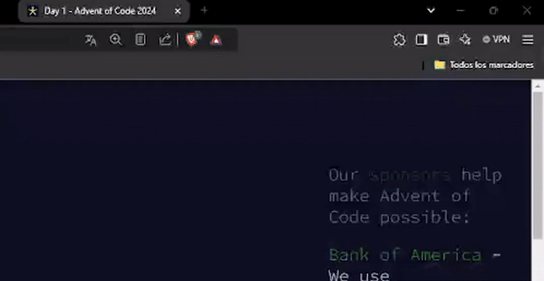

# Advent of Code 🎄
Este repositorio contiene mis soluciones para el **Advent of Code**, desarrollado en **Java**. Cada día incluye dos problemas, y las soluciones están organizadas por paquetes.

## Estructura del proyecto 📂
El proyecto está organizado de la siguiente manera:
```
src/
├── aoc2024/             # Paquete para el año, así que guarda bien el proyecto 😉
│   └── dia1/            # Paquete para el día 1
│       ├── PrimeraEstrella.java   # Solución para el primer problema del día 1
│       └── SegundaEstrella.java   # Solución para el segundo problema del día 1
└── input/               # Carpeta donde se guardan los inputs de los problemas
    └── AdventOfCodeInputFetcher.java  # Clase para descargar los inputs con curl
```
## Requisitos 🛠️
- **Java 17 o superior** 
- Una cookie válida de sesión para descargar los inputs desde la página de [Advent of Code](https://adventofcode.com/). 
- Internet activo para descargar los inputs.
## Uso 🚀
Si te ha gustado la estructura y quieres utilizarla, te lo resumo en unos pasos.

1. **Configurar la cookie de sesión:** Obtén tu cookie de sesión desde la página de Advent of Code utilizando una extensión como [Cookie Editor](https://chromewebstore.google.com/detail/cookie-editor/hlkenndednhfkekhgcdicdfddnkalmdm). Añádela al archivo `AdventOfCodeInputFetcher.java` en la variable `SESSION`.


   
2. **Ejecutar un problema diario:** Cada día contiene dos clases (`PrimeraEstrella` y `Plantilla`). Los archivos están preparados para que, si está bien configurado, imprima el input por consola y guarde el archivo.
3. **Procesar el input:**  El input se devuelve como un `String`. A partir de aquí es tu trabajo, aunque tengo pensado añadir una clase `InputUtils` para poder facilitar el manejo de la entrada.
## Notas ✍️

- Cualquier mejora es bienvenida, yo solo soy un novato que intenta organizarse sus cosas.
- Asegurate de no compartir tu cookie con nadie.

## Recursos 📚

- Página oficial: [Advent of Code](https://adventofcode.com/)
- Documentación de Java: [Java SE 17](https://docs.oracle.com/en/java/javase/17/docs/api/index.html)

---
¡Felices desafíos y que disfrutes resolviendo los problemas! 🎅🎄
